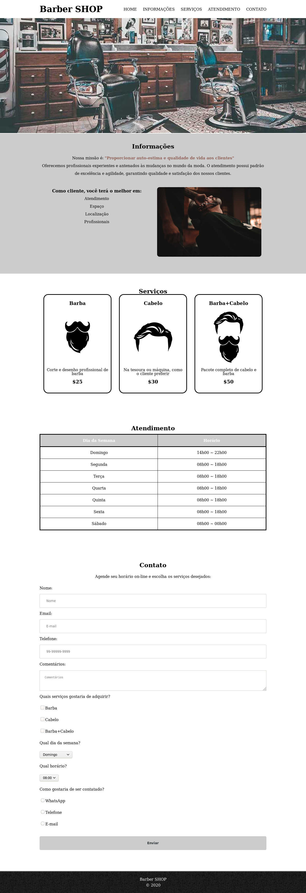

# Barber SHOP

Uma landing page criada para praticar os conhecimentos obtidos nos cursos de HTML5 /CSS3:
- HTML5 e CSS3 parte 1: A primeira página da Web
- HTML5 e CSS3 parte 2: Posicionamento, listas e navegação
- HTML5 e CSS3 parte 3: Trabalhando com formulários e tabelas
- HTML5 e CSS3 parte 4: Avançando no CSS

Versionamento realizado utilizando os conhecimentos obtidos nos cursos de git:
- Git e Github: Controle e compartilhe seu código
- Git e Github: Estratégias de ramificação, Conflitos e Pull Requests

## Objetivo:

O objetivo é criar uma landing page a partir do conteúdo estudado nos cursos de
html/css, seguindo os user stories de cada feature.

Inicialmente teremos as seguintes etapas:

0. Criação do repositório
1. Página básica: Criando a estrutura e preenchendo o conteúdo básico.
2. Posicionamento, listas e navegação.
3. Trabalhando com formulário e tabelas.
4. Melhorando o CSS.

Inicialmente o projeto deverá utilizar somente com tecnologias html/css.

## 0. Criação do repositório

A forma de organização de desenvolvimento do projeto será baseada no Git Flow.

Desta forma, para o controle de versão, o projeto deverá seguir as seguintes regras:

- Criar o repositório no github;
- Configurar o projeto/repositório no ambiente local, adicionando o repositório remoto (github) ao git;
- Criar um arquivo README.md adicionando a descrição inicial do projeto;
- Realizar o primeiro commit;
- Versionar o primeiro commit;
- Enviar as alterações/tag para o github;
- No ambiente local:
	- criar um branch da master para o desenvolvimento chamada `development`;
	- criar um branch para cada feature a seguir:
		1. Página básica: Criando a estrutura e preenchendo o conteúdo básico.
		2. Posicionamento, listas e navegação.
		3. Trabalhando com formulário e tabelas.
		4. Melhorando o CSS.
	- criar um branch de release;
	- caso necessário, criar branches de hotfixes a partir da master;

## 1. Página Básica

User stories desta feature:

- Utilizar tags h1 e p; :heavy_check_mark:
- Utilizar negrito e tag strong; :heavy_check_mark:
- Ênfase em textos com itálico e tag em; :heavy_check_mark:
- Informar ao navegador a versão do html utilizado, com a tag adequada; :heavy_check_mark:
- Informar ao navegador o idioma utilizado; :heavy_check_mark:
- Informar ao navegador o charset utilizado; :heavy_check_mark:
- Definir um título principal para a página; :heavy_check_mark:
- Aplicar estilos à página utilizando recursos de:
	- alinhamento; :heavy_check_mark:
	- tamanho de fonte; :heavy_check_mark:
	- cores e textos; :heavy_check_mark:
	- cores de fundo; :heavy_check_mark:
- Ajustar tamanho dos elementos utilizando tags; :heavy_check_mark:
- Configurar espaçamento e externo dos elementos; :heavy_check_mark:
- Criar listas; :heavy_check_mark:
- Aplicar o conceito de classes aos elementos; :heavy_check_mark:
- Dividir seções no arquivo de forma básica; :heavy_check_mark:
- Alterar o comportamento dos elementos; :heavy_check_mark:

## 2. Posicionamento, listas e navegação

User stories desta feature:

- Revisar o conteúdo html e css, concluindo os `TODO` em aberto; ✔
- Criar links; ✔
- Transformar textos em letras maiúsculas; ✔
- Revisar estilos com inline e block; ✔
- Remover decoração de textos; ✔
- Limpar estilos criados pelo navegador; ✔
- Utilizar posicionamento static, relative ou absolute; ✔
- Utilizar a tag main; ✔
- Pseudo-classes:Aplicar comportamentos com hover/active; ✔
- Estilizar bordas; ✔
- Utilizar tag footer; ✔
- Utilizar imagem como background; ✔
- Conhecer a tabela unicode; ✔

## 3. Trabalhando com formulários e tabelas

User stories desta feature:

- implementar um formulário de contato contendo:
	- form ✔
	- inputs (email, tel, number, password, date, datetime, month, search) ✔
		- atributos required, placeholder  ✔
	- for (associados) ✔
	- label (associados) ✔
	- submit ✔
	- estilo ✔
	- radio buttons ✔
	- checkbox ✔
	- select ✔
	- fieldset ✔
- texto alternativo em imagens ✔
- legend ✔
- transition ✔
- cursor ✔
- transform
- implementar uma tabela contendo tags:
	- table ✔
	- tr ✔
	- td ✔
	- thead ✔
	- tbody  ✔
	- th ✔
	- tfoot ✔
	- estilo ✔
- criar um seção para os produtos  ✔

## 4. Avançando no CSS

User stories dessa feature:

- padronizar as seções ✔
- aplicar fluturação com float/clear ✔
- utilizar fontes externa ✔
- incorporar um mapa ✔
- incorporar um video ✔
- novas pseudo-classes ✔
- pseudo-elementos ✔
- bg gradiente ✔
- seletores avançados com ✔
	- +, >, ~, not,  ✔
- calc  ✔
- aplicar opacity ✔
- box-shadow ✔
- text-shadow ✔
- estilizar com simbolos unicode ✔
- revisar TODO's ✔

